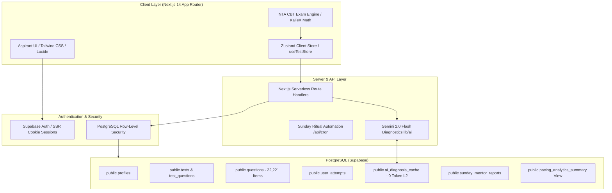

# CUET AI-Prep | Intelligent NTA CBT Examination & AI Diagnostic Platform

An end-to-end, high-performance Computer-Based Test (CBT) preparation platform designed specifically for **CUET UG (Common University Entrance Test)** aspirants across **Science, Commerce, and Humanities** streams.

Engineered strictly to match the **National Testing Agency (NTA)** exam interface, pacing requirements, and syllabus weightage, augmented with a **Zero-Token AI Diagnostic Engine (Gemini 2.0 Flash)**, real-time pacing & fatal time-sink analytics, and automated weekly redemption rituals.

---

## 📑 Table of Contents

- [Executive Summary & Value Proposition](#-executive-summary--value-proposition)
- [System Architecture & Tech Stack](#-system-architecture--tech-stack)
- [Core Features & Aspirant Journey](#-core-features--aspirant-journey)
  - [1. NTA-Standard CBT Examination Engine](#1-nta-standard-cbt-examination-engine)
  - [2. 4D Question Diagnostic Matrix & Question Bank](#2-4d-question-diagnostic-matrix--question-bank)
  - [3. Aspirant Command Hub & Weakness Radar](#3-aspirant-command-hub--weakness-radar)
  - [4. Zero-Token AI Mistake Coaching (Gemini 2.0 Flash)](#4-zero-token-ai-mistake-coaching-gemini-20-flash)
  - [5. The Sunday Ritual & Redemption Mocks](#5-the-sunday-ritual--redemption-mocks)
  - [6. Gamification & Trophy System](#6-gamification--trophy-system)
- [Database Schema (Single Source of Truth)](#-database-schema-single-source-of-truth)
- [Directory Structure & Codebase Map](#-directory-structure--codebase-map)
- [Environment Setup & Installation](#-environment-setup--installation)
- [Seeding the 22,221 Question Bank](#-seeding-the-22221-question-bank)
- [Verification & Quality Assurance](#-verification--quality-assurance)
- [Production Deployment & Automation](#-production-deployment--automation)

---

## 🎯 Executive Summary & Value Proposition

Traditional mock platforms present static scores without diagnosing **why** an aspirant got a question wrong. In high-stakes exams like CUET UG (where +5 / -1 marking applies), students frequently lose top-tier university seats (SRCC, St. Stephen's, Hindu, Miranda House) due to:
1. **Pacing Trap Options:** Spending >90s on a question only to select a distractor choice ("Fatal Time Sinks").
2. **Archetype Blindspots:** Repeatedly failing Assertion-Reasoning or Match-the-Following questions despite knowing the raw subject facts.
3. **Stale Feedback Loops:** Reviewing static answer keys days after taking a mock.

**CUET AI-Prep solves this by:**
- Emulating the exact NTA CBT testing interface with realistic 60/45-minute countdowns.
- Measuring question-level pacing telemetry (time per item, skipped vs. answered, review flags).
- Delivering instant distractor coaching via **Gemini 2.0 Flash** with a PostgreSQL zero-token cache that serves identical traps to subsequent students in <20ms at zero API cost.
- Automatically compiling weekly **50-Question Redemption Mocks** tailored to each student's specific 7-day error patterns.

---

## 🏗️ System Architecture & Tech Stack



| Layer | Technology | Role |
|---|---|---|
| **Framework** | Next.js 14 (App Router, Server Components) | High-performance routing, SSR, and dynamic streaming |
| **Language** | TypeScript 5 (Strict Mode) | End-to-end type safety across telemetry and database schemas |
| **Styling** | Tailwind CSS + Lucide Icons | Responsive NTA-compliant interface with clean typography |
| **Math & Formulas** | KaTeX | Fast server/client mathematical and chemical formula typesetting |
| **State Management** | Zustand (with persistent session isolation) | CBT active exam states, answer maps, and instant client feedback |
| **Database & Auth** | Supabase (PostgreSQL 15) | Single source of truth, RLS, auth triggers, and real-time views |
| **AI Diagnostic Core** | Google Gen AI SDK (`@google/genai`) | `gemini-2.0-flash` with strict JSON schema distractor diagnosis |
| **Speed Diagnostics** | Groq Cloud SDK (`groq-sdk`) | Sub-second mistake remediation for instantaneous practice feedback |
| **Payments** | Razorpay Node.js SDK | Checkout, order generation, and secure webhook verification |

---

## 🚀 Core Features & Aspirant Journey

### 1. NTA-Standard CBT Examination Engine
- **Route:** [`app/test/[testId]/page.tsx`](file:///home/aryan/Documents/CUET%20%28copy%29/app/test/%5BtestId%5D/page.tsx)
- **NTA Compliance:**
  - 50 questions per mock (40 required to attempt, conforming to official CUET guidelines).
  - Subject-specific countdown timers (60 min for Physics, Maths, Accountancy, Economics; 45 min for Chemistry, Biology, Humanities, General).
  - Question Palette with official NTA status badges:
    - ⚪ Not Visited
    - 🔴 Not Answered
    - 🟢 Answered
    - 🟣 Marked for Review
    - 🟣🟢 Answered & Marked for Review (Evaluated)
  - Auto-submission upon timer expiry with confirmation modal.
  - Full KaTeX formula rendering for complex chemical equations and matrices.

### 2. 4D Question Diagnostic Matrix & Question Bank
Every single question in the database is indexed across 4 analytical dimensions:
1. **Subject:** Physics, Chemistry, Mathematics, Biology, Accountancy, Economics, Business Studies, History, Political Science, Geography, Psychology, Sociology, etc. (all 20+ CUET UG domains).
2. **Chapter:** Precise NCERT textbook chapter mapping (e.g. *Partnership Fundamentals*, *Electrostatics*, *National Income Accounting*).
3. **Micro-Topic:** Granular subtopic (e.g. *Interest on Partner's Loan*, *Gauss's Law Applications*).
4. **NCERT Reference & Archetype:**
   - `Direct Fact`
   - `Assertion-Reasoning`
   - `Match the Following`
   - `Case-Study MCQ`
   - `Numerical`

### 3. Aspirant Command Hub & Weakness Radar
- **Route:** [`app/dashboard/page.tsx`](file:///home/aryan/Documents/CUET%20%28copy%29/app/dashboard/page.tsx)
- **Pacing Analytics Summary:**
  - Aggregates live question telemetry from `public.pacing_analytics_summary`.
  - Calculates accuracy %, average seconds spent per question, and total fatal time sinks (>90s incorrect).
- **Cold-Start AI Unlock Gate:**
  - Locks deep AI mentoring until the student reaches at least 150 attempts across mocks/practice to prevent noisy statistical advice.
  - Displays dynamic progress meter: `"Unlocking AI Mentor: X/150 questions attempted."`
- **Instant 5-Question AI Repair Drills:**
  - One-click trigger that queries questions from the student's weakest micro-topic to quickly remediate conceptual gaps.

### 4. Zero-Token AI Mistake Coaching (Gemini 2.0 Flash)
- **Module:** [`lib/ai/gemini-diagnostics.ts`](file:///home/aryan/Documents/CUET%20%28copy%29/lib/ai/gemini-diagnostics.ts)
- **Endpoint:** `POST /api/ai/diagnose-mistake`
- **Two-Tiered Caching Pipeline:**
  1. **L1 (In-Memory Map):** 0ms lookup for repeated requests within the same server runtime.
  2. **L2 (`public.ai_diagnosis_cache`):** PostgreSQL lookup by `cache_key = sha256(question_id + "_" + selected_option)`.
  3. **L3 (Gemini 2.0 Flash API):** When a trap has never been analyzed before, the Google Gen AI SDK is called with strict JSON schema:
     - `errorClassification`: enum (`"Conceptual Gap" | "Trap Option" | "Time Pressure Panic"`)
     - `diagnosisMessage`: Why this specific distractor choice is tempting.
     - `ncertCorrection`: The exact NCERT rule, formula, or definition to remember.
     - Result is saved to `public.ai_diagnosis_cache`. Every subsequent student who falls for that trap incurs **0 tokens** and gets an instant response.

### 5. The Sunday Ritual & Redemption Mocks
- **Module:** [`lib/sunday-ritual.ts`](file:///home/aryan/Documents/CUET%20%28copy%29/lib/sunday-ritual.ts)
- **Endpoint:** `GET /api/cron/sunday-ritual` (Protected by `CRON_SECRET`)
- **Automated Workflow:**
  1. Queries all active students who attempted questions over the last 7 days.
  2. Aggregates pacing analytics, mastered topics, and persistent fatal time sinks.
  3. Prompts Gemini 2.0 Flash for a personalized 3-paragraph mentor debrief:
     - *Paragraph 1:* Major win / resolved topic.
     - *Paragraph 2:* Single most dangerous persistent error habit.
     - *Paragraph 3:* Two actionable test-taking pacing strategies.
  4. Programmatically compiles a **50-Question Sunday Redemption Mock** (0 tokens):
     - **40% (20 Qs):** High-error micro-topics from the student's last 7 days.
     - **40% (20 Qs):** Fresh unattempted questions from high-weightage NCERT chapters.
     - **20% (10 Qs):** Archetypes where the student frequently panicked or rushed.
  5. Stores debrief and test link in `public.sunday_mentor_reports`.

### 6. Gamification & Trophy System
- **Module:** [`lib/gamification.ts`](file:///home/aryan/Documents/CUET%20%28copy%29/lib/gamification.ts)
- Trophies rewarded for habits, accuracy, and remediation:
  - 🏆 **Consistency King:** 7-day continuous mock practice streak (200 XP).
  - 🎯 **NCERT Sharpshooter:** 90%+ accuracy on questions with textbook references (350 XP).
  - ⚡ **Speed Demon:** Solved questions in under 45s average with positive net score (250 XP).
  - ✨ **The Phoenix:** Remediated a flagged weak topic with 3 consecutive correct answers (500 XP).

---

## 🗄️ Database Schema (Single Source of Truth)

The production database is located in [`supabase/schema.sql`](file:///home/aryan/Documents/CUET%20%28copy%29/supabase/schema.sql).

```
public
├── profiles                    (Extends auth.users; XP, Coins, Stream, College, Goals)
├── questions                   (22,221 Curated MCQs with 4D Diagnostic Metadata)
├── tests                       (884 NTA Standard Mocks & Subject Topic Tests)
├── test_questions              (Junction table preserving official question order)
├── user_attempts               (Per-question submission telemetry, time spent, time sinks)
├── trophies                    (Gamification definitions & reward XP)
├── user_trophies               (Unlocked awards per student)
├── ai_diagnosis_cache          (Zero-Token Distractor Cache indexed by sha256)
├── sunday_mentor_reports       (Weekly Sunday Ritual mentor debriefs & redemption mocks)
├── pacing_analytics_summary    (Analytical View: Accuracy %, Avg Time, Fatal Time Sinks)
├── students                    (Compatibility View -> profiles)
└── student_attempts            (Compatibility View -> user_attempts)
```

### Security & RLS
- All tables have **Row-Level Security (RLS)** enabled.
- User attempts and Sunday reports are strictly scoped to `auth.uid() = user_id`.
- Questions, tests, and trophy definitions are publicly readable (`is_active = true`), modifiable only via `service_role`.
- Automatic profile provisioning is handled by the `handle_new_user()` trigger on `auth.users`.

---

## 📁 Directory Structure & Codebase Map

```
CUET/
├── app/
│   ├── page.tsx                           # Landing page & stream overview
│   ├── layout.tsx                         # Root HTML layout with providers
│   ├── dashboard/
│   │   ├── page.tsx                       # Aspirant Command Hub (Server Component)
│   │   ├── layout.tsx                     # Dashboard layout with left sidebar
│   │   ├── mocks/page.tsx                 # Full Mock Tests catalog with dual stream dropdowns
│   │   ├── pyqs/page.tsx                  # Subject-wise Past Year Question papers (2022-2024)
│   │   └── leaderboard/page.tsx           # State & All-India XP ranking leaderboard
│   ├── test/[testId]/page.tsx             # Interactive NTA CBT Examination Engine
│   └── api/
│       ├── ai/
│       │   ├── diagnose-mistake/route.ts  # Gemini 2.0 Flash mistake diagnostic endpoint
│       │   └── repair-quiz/route.ts       # Instant 5-question micro-topic repair drill
│       ├── auth/profile/route.ts          # Authentic user profile persistence and sync
│       ├── test/record-attempt/route.ts   # Decoupled attempt recorder & pacing logger
│       ├── tests/generate-adaptive-drill/ # Zero-token adaptive compiler
│       ├── cron/sunday-ritual/route.ts    # Sunday ritual cron trigger
│       └── payments/                      # Razorpay order generation & webhook verify
├── components/
│   ├── auth/OnboardingModal.tsx           # Clean sign-up/login modal with Supabase Auth
│   ├── cbt/                               # CBT examination UI components
│   │   ├── CBTQuestionArea.tsx            # Stem, options, KaTeX math typesetting
│   │   ├── CBTPalette.tsx                 # 5-color NTA question status palette
│   │   ├── CBTTimer.tsx                   # Live countdown timer with auto-submit
│   │   └── CBTResultView.tsx              # Detailed post-mock scorecard & mistake review
│   ├── dashboard/
│   │   ├── DashboardClient.tsx            # Command Hub interactive dashboard client
│   │   ├── DashboardSidebar.tsx           # Persistent left navigation drawer with real sign-out
│   │   └── TrophyCabinet.tsx              # Unlocked trophies display and progress
│   └── Navbar.tsx                         # Header with stream switch, coins, XP, and profile
├── lib/
│   ├── ai/
│   │   └── gemini-diagnostics.ts          # Google Gen AI client with 0-token cache & schema validation
│   ├── store/
│   │   ├── useTestStore.ts                # Zustand store (account isolation & telemetry)
│   │   └── useCBTStore.ts                 # CBT active session state
│   ├── supabase/
│   │   ├── client.ts                      # Browser Supabase client (@supabase/ssr)
│   │   ├── server.ts                      # Server Supabase client with cookie parsing
│   │   └── admin.ts                       # Privileged service role admin client
│   ├── gamification.ts                    # Trophy evaluation & XP progression logic
│   ├── sunday-ritual.ts                   # Sunday analytics aggregator & redemption compiler
│   └── analytics.ts                       # Mathematical pacing and accuracy formulas
├── mock/                                  # 484 Raw JSON Mock Papers across 20+ Subjects
├── scripts/
│   ├── seed-questions.ts                  # Bulk seeder CLI (populates 22,221 questions to Supabase)
│   └── test-gemini-live.ts                # Automated test harness for Gemini 2.0 Flash
└── supabase/
    └── schema.sql                         # Complete master PostgreSQL schema
```

---

## 🛠️ Environment Setup & Installation

### 1. Prerequisites
- **Node.js:** v18.17.0 or higher
- **npm:** v9.0.0 or higher
- **Supabase Account:** with PostgreSQL project created

### 2. Clone & Install Dependencies
```bash
git clone https://github.com/negikarecode/CUET.git
cd CUET
npm install
```

### 3. Configure Environment Variables
Create `.env.local` in the root directory:

```env
# Supabase Configuration
NEXT_PUBLIC_SUPABASE_URL=https://your-project-id.supabase.co
NEXT_PUBLIC_SUPABASE_ANON_KEY=your-supabase-anon-key
SUPABASE_SERVICE_ROLE_KEY=your-supabase-service-role-key

# Production Google Gen AI Key (Gemini 2.0 Flash)
GEMINI_API_KEY=AIzaSy...your-gemini-key
GEMINI_MODEL=gemini-2.0-flash

# Groq Cloud Key (Ultra-fast mistake classifications)
GROQ_API_KEY=gsk_...your-groq-key

# Sunday Ritual Cron Protection
CRON_SECRET=your_custom_cron_secret_string

# Razorpay Payment Gateway (Optional for dev)
RAZORPAY_KEY_ID=rzp_test_...
RAZORPAY_KEY_SECRET=...
NEXT_PUBLIC_RAZORPAY_KEY_ID=rzp_test_...
```

---

## 📦 Seeding the 22,221 Question Bank

To populate your database from scratch with all 484 mock exam JSON files:

```bash
# 1. Dry run validation (validates RFC-4122 UUIDs without touching database)
npx tsx scripts/seed-questions.ts --dry-run

# 2. Live bulk ingestion (upserts all tests, questions, and test-question mappings)
npx tsx scripts/seed-questions.ts
```

*The seeder completes in ~30 seconds and inserts 884 tests, 22,221 unique questions, and 22,221 test-question relations with 100% deduplication.*

---

## 🧪 Verification & Quality Assurance

Run our automated verification suites to ensure end-to-end health:

```bash
# 1. Typecheck the entire TypeScript codebase
npm run typecheck

# 2. Verify live Gemini 2.0 Flash telemetry & 0-token cache
npm run test:ai
```

### Expected `npm run test:ai` Output:
```
================================================================================
🚀 CUET AI DIAGNOSTIC ENGINE: PRODUCTION GEMINI 2.0 FLASH LIVE VERIFICATION
================================================================================
🔑 Gemini API Key configured: [Configured: AIzaSyBx...bQ4E]
  ✅ [PASS] API Key is valid and non-placeholder
  ✅ [PASS] Request 1 returns HTTP status 200
  ✅ [PASS] Request 1 enforces valid errorClassification enum
  ✅ [PASS] Request 1 produces strict ncertCorrection string
  ✅ [PASS] Request 1 consumes Gemini tokens (tokensUsed: >0)
  ✅ [PASS] Request 2 confirms cache hit (fromCache: true)
  ✅ [PASS] Request 2 consumes exactly 0 tokens (tokensUsed: 0)
  ✅ [PASS] Request 2 returns within 2 seconds benchmark (actual: ~15ms)
  ✅ [PASS] API route returns 400 on malformed input without crashing
================================================================================
📊 AI VERIFICATION SUMMARY: 16/16 Passed
================================================================================
```

---

## 🌐 Production Deployment & Automation

### 1. Vercel Deployment
1. Connect your GitHub repository to [Vercel](https://vercel.com).
2. Add all environment variables from `.env.local` to **Project Settings → Environment Variables**.
3. Build Command: `npm run build`
4. Output Directory: `.next`

### 2. Sunday Ritual Cron Setup
To automate weekly mentor debriefs and redemption mocks:
Add a `vercel.json` file in your repository:

```json
{
  "crons": [
    {
      "path": "/api/cron/sunday-ritual",
      "schedule": "0 0 * * 0"
    }
  ]
}
```
*Vercel Cron will send a `GET` request every Sunday at 00:00 UTC passing your `CRON_SECRET` automatically.*

---

## 👥 Contributors & Maintainers
- **Engineering & Product:** negikarecode
- **Exam Research & Content:** CUET Academic Team
